# Data Engineer End to End project
**Table of Content**
- [Project overview](#project-overview)
- [Data collection with Python](#data-collection-with-python)
- [Data wrangling with Spark](#data-wrangling-with-spark)
- [Data storage with Google Cloud Storage (GCS)](#data-storage-with-google-cloud-storage-gcs)
- [Automated data pipeline with Airflow](#automated-data-pipeline-with-airflow)
- [Building Data Warehouse with BigQuery](#building-data-warehouse-with-bigquery)

## Project overview

This project builds an automated end-to-end data pipeline that aims to learn about data engineer process from data collection, data cleaning, data storaging, automated pipeline with airflow and build data warehouse.

Firstly, we extract the books data from MySQL database and currency exchange rate from API. Also clean the data with Pyspark. Then we load them into Google Data Storage (Data Lake) and schedule a data pipeline (Airflow) to automate daily to load the data into Google BigQuery (Data Warehouse).

## Data collection with Python
We use python to collect data from database and API. Then we merge it into csv file.
1. Connect to database with pymysql, query table and convert to Pandas for better visual.

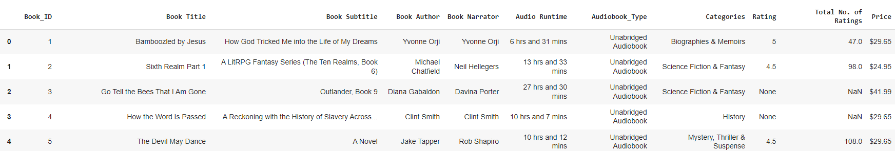

2. Query another table with Pandas

3. Join 2 table (audible_transaction & audible_data)

4. Read data from REST API [link](https://r2de2-workshop-vmftiryt6q-ts.a.run.app/usd_thb_conversion_rate) ,convert to Pandas and indexing the table.

5. Join the conversion rate table and previous table with Pandas to make THB price column.

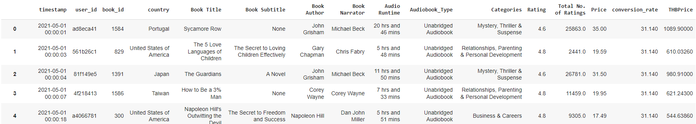

6. Save the result to csv file.

## Data wrangling with Spark
1. Install Spark and PySpark

2. Data profiling and find if there are missing values with Spark 

3. Exploratory Data Analysis (EDA)
- Non-Graphical EDA: We can use where clause to show what you want to looking for. Spark will show only tops 20 row from show() function.

- Graphical EDA: We will use seaborn or matplotlib wiith pandas instead, because spark cannot do the plotting job.

Boxplot to show number distribution and outliers

4. Data cleansing with Spark
- Data type convert from string to date time

- Show timestamp column to see if it's (DD/MM/YYYY or MM/DD/YYYY)

- Using pyspark.sql.function (to_timestamp) to convert

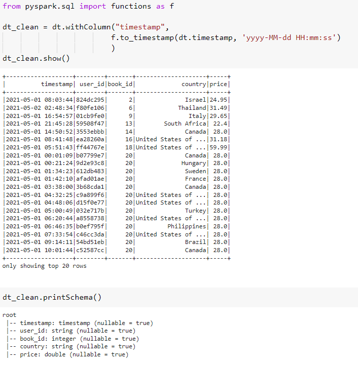

5. Data cleansing with Spark SQL
- Convert spark dataframe to TempView

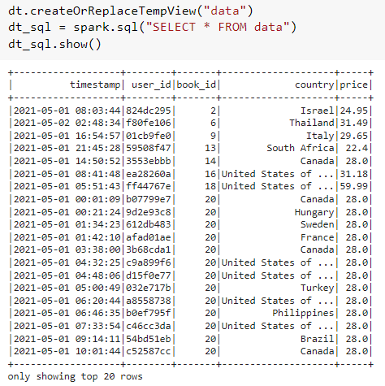

- Check if user_id column is not 8 character long and then correct them

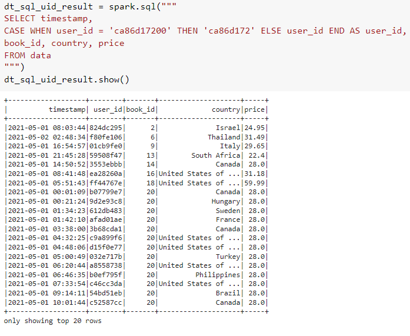

6. Save data to CSV file

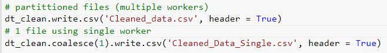

## Data storage with Google Cloud Storage (GCS)
1. Create project and bucket on Google Cloud Storage (Data Lake) via web UI
2. Upload previous CSV file into data lake via cloud shell
- upload file into vm first
- then use gsutil command to copy file into bucket

## Automated data pipeline with Airflow
1. First, create Cloud Composer to run Apache Airflow in it.
2. Insall Python packages in Airflow at PYPI PACKAGES tab in recently created environment.
- pymysql
- requests
- pandas
3. Create MySQL connection in airflow to connect with the database
4. Coding previous process (Read data from database, read API as CSV and merge data) into one python file.

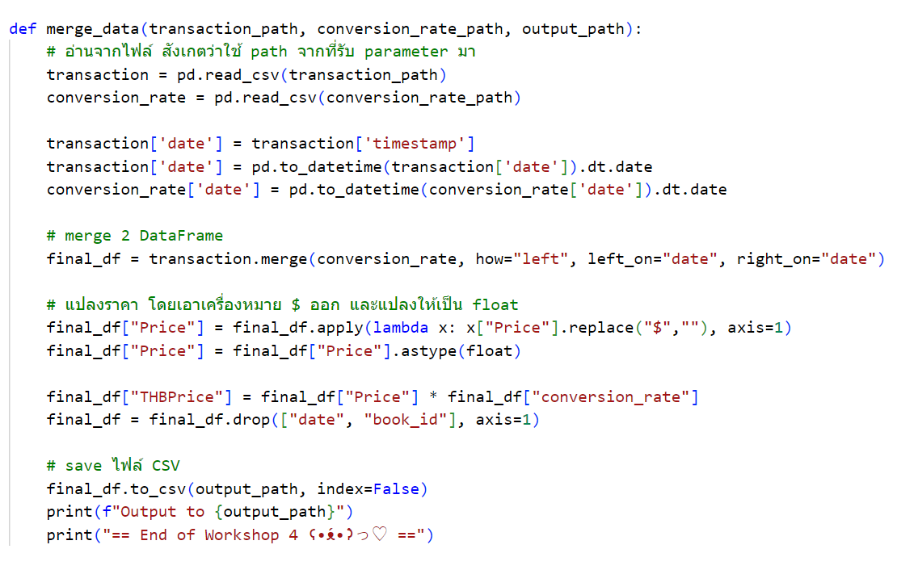

5. Also, with DAG command and dependencies

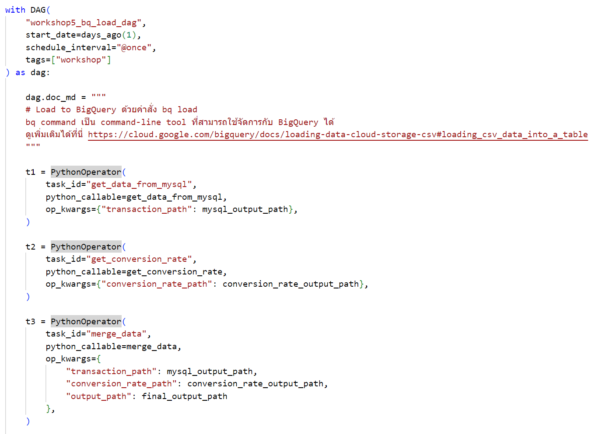

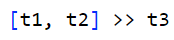

6. The final output will automatically upload to Google Cloud Studio

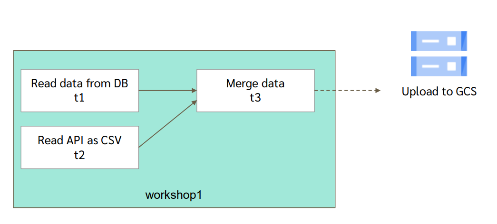

## Building Data Warehouse with BigQuery
1. After we try some Airflow DAGs, we will continue to move the completed final output into Google BigQuery (Data Warehouse) for easier analytic usage.
2. Firstly, we must create dataset on Google BigQuery.
- Important! Data location must be the same with Cloud Composer location
3. Again, go to previous DAG file to automatic load data to dataset on Google BigQuery using BashOperator.

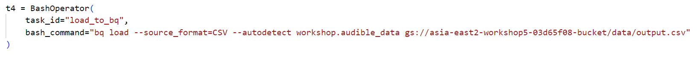

4. Create dependencies in Airflow to automatically run the project.

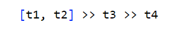

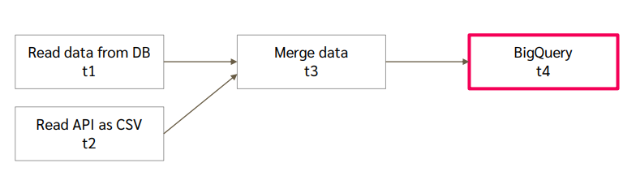

5. Now we can use the BigQuery to query the data you want to analyze with SQL language.
