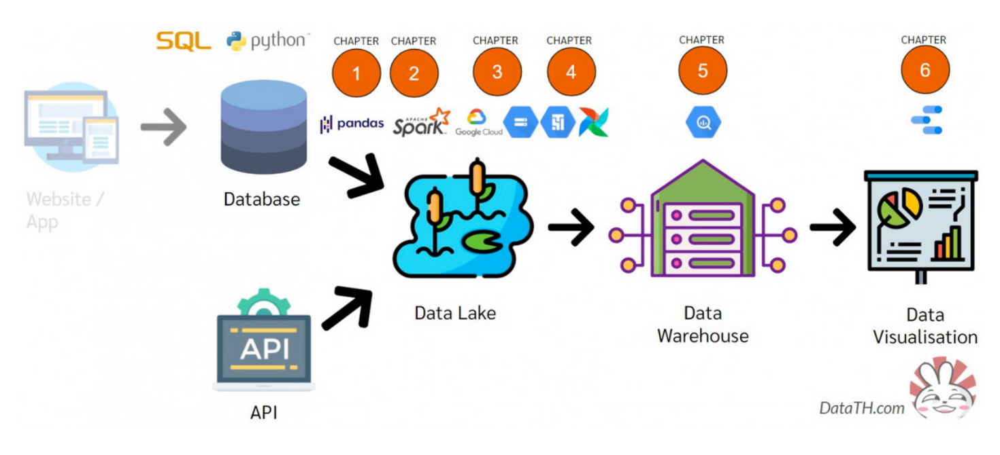

# Data Engineer End to End project
**Table of Content**
- [Project overview](##project-overview)
- [Data collection with Python](##data-collection-with-python)
- Data wrangling with Spark
- Data storage with Google Cloud Storage (GCS)
- Automated data pipeline with Airflow
- Building Data Warehouse with BigQuery

## Project overview

This project builds an automated end-to-end data pipeline that aims to learn about data engineer process from data collection, data cleaning, data storaging, automated pipeline with airflow and build data warehouse.

Firstly, we extract the books data from MySQL database and currency exchange rate from API. Also clean the data with Pyspark. Then we load them into Google Data Storage (Data Lake) and schedule a data pipeline (Airflow) to automate daily to load the data into Google BigQuery (Data Warehouse).

## Data collection with Python

