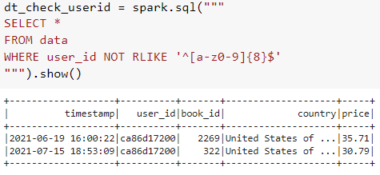

# Data Engineer End to End project
**Table of Content**
- [Project overview](#project-overview)
- [Data collection with Python](#data-collection-with-python)
- [Data wrangling with Spark](#data-wrangling-with-spark)
- [Data storage with Google Cloud Storage (GCS)](#data-storage-with-google-cloud-storage-gcs)
- [Automated data pipeline with Airflow](#automated-data-pipeline-with-airflow)
- [Building Data Warehouse with BigQuery](#building-data-warehouse-with-bigquery)

## Project overview

This project builds an automated end-to-end data pipeline that aims to learn about data engineer process from data collection, data cleaning, data storaging, automated pipeline with airflow and build data warehouse.

Firstly, we extract the books data from MySQL database and currency exchange rate from API. Also clean the data with Pyspark. Then we load them into Google Data Storage (Data Lake) and schedule a data pipeline (Airflow) to automate daily to load the data into Google BigQuery (Data Warehouse).

## Data collection with Python
We use python to collect data from database and API. Then we merge it into csv file.
1. Connect to database with pymysql, query table and convert to Pandas for better visual.

2. Query another table with Pandas

3. Join 2 table (audible_transaction & audible_data)

4. Read data from REST API [link](https://r2de2-workshop-vmftiryt6q-ts.a.run.app/usd_thb_conversion_rate) ,convert to Pandas and indexing the table.

5. Join the conversion rate table and previous table with Pandas to make THB price column.

6. Save the result to csv file.

## Data wrangling with Spark
1. Install Spark and PySpark

2. Data profiling and find if there are missing values with Spark 

3. Exploratory Data Analysis (EDA)
- Non-Graphical EDA: We can use where clause to show what you want to looking for. Spark will show only tops 20 row from show() function.

- Graphical EDA: We will use seaborn or matplotlib wiith pandas instead, because spark cannot do the plotting job.

Boxplot to show number distribution and outliers

4. Data cleansing with Spark
- Data type convert from string to date time

- Show timestamp column to see if it's (DD/MM/YYYY or MM/DD/YYYY)

- Using pyspark.sql.function (to_timestamp) to convert

5. Data cleansing with Spark SQL
- Convert spark dataframe to TempView

- Check if user_id column is not 8 character long and then correct them

6. Save data to CSV file

## Data storage with Google Cloud Storage (GCS)

## Automated data pipeline with Airflow

## Building Data Warehouse with BigQuery
